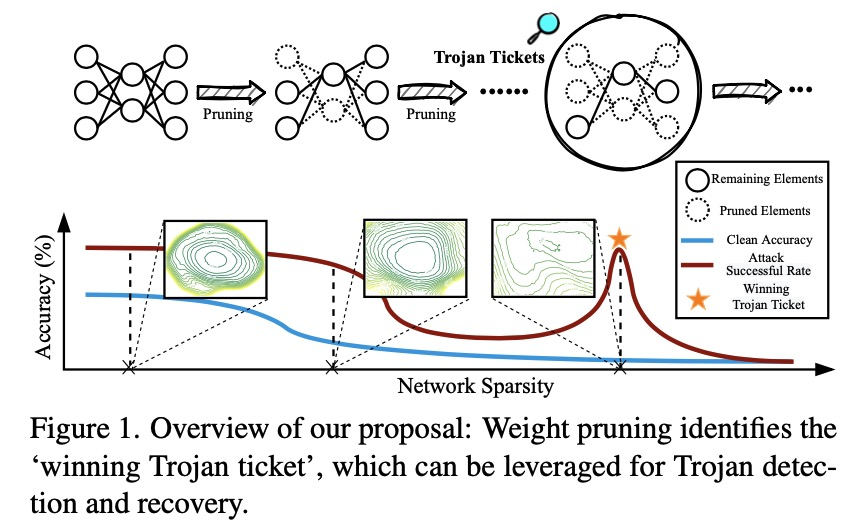

# Quarantine: Sparsity Can Uncover the Trojan Attack Trigger for Free

[](https://opensource.org/licenses/MIT)

Codes for this paper **Quarantine: Sparsity Can Uncover the Trojan Attack Trigger for Free** [CVPR2022]

Tianlong Chen\*, Zhenyu Zhang\*, Yihua Zhang\*, Shiyu Chang, Sijia Liu, Zhangyang Wang


## Overview:

Trojan attacks threaten deep neural networks (DNNs) by poisoning them to behave normally on most samples, yet to produce manipulated results for inputs attached with a particular trigger. Several works attempt to detect whether a given DNN has been injected with a specific trigger during the training. In a parallel line of research, the lottery ticket hypothesis reveals the existence of sparse subnetworks which are capable of reaching competitive performance as the dense network after independent training. Connecting these two dots, we investigate the problem of Trojan DNN detection from the brand new lens of sparsity, even when no clean training data is available. Our crucial observation is that the Trojan features are significantly more stable to network pruning than benign features. Leveraging that, we propose a novel Trojan network detection regime: first locating a ``winning Trojan lottery ticket" which preserves nearly full Trojan information yet only chance-level performance on clean inputs; then recovering the trigger embedded in this already isolated subnetwork. 




## Prerequisites

```
pytorch >= 1.4
torchvision
advertorch
```


## Usage

1. Iterative magnitude pruning on CIFAR-10 with ResNet-20,  RGB trigger.

```
bash script/imp_cifar10_resnet20_color_trigger.sh [data-path]
```

2. Calculate trojan score:

```
bash script/linear_mode_cifar10_res20_color_trigger.sh [data-path] [model-path]
```

3. Recover trigger and detection

```
bash script/reverse_trigger_cifar10_resnet20.sh [data-path] [model-file]
```


## Pretrained models

**CIFAR-10, ResNet-20, RGB trigger:** Pretrained_model/cifar10_res20_rgb_trigger

More models are coming soon...


## Citation

```
@article{chen2022quarantine,
  title={Quarantine: Sparsity Can Uncover the Trojan Attack Trigger for Free},
  author={Chen, Tianlong and Zhang, Zhenyu and Zhang, Yihua and Chang, Shiyu and Liu, Sijia and Wang, Zhangyang},
  journal={arXiv preprint arXiv:2205.11819},
  year={2022}
}
```

